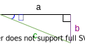

# Simple triangle calculator



calculate alpha by right triangle edge lengths

## File build
### build

```bash
npm run build
```
copy build directory to destination


### deploy with S3

```bash
s3cmd put --acl-public -r ./build/* s3://apps/triangle-1/
```

## Docker / kubernetes build

### docker build

```bash
docker build -t triangle .
docker run -it --rm -p 80:80 triangle
```

